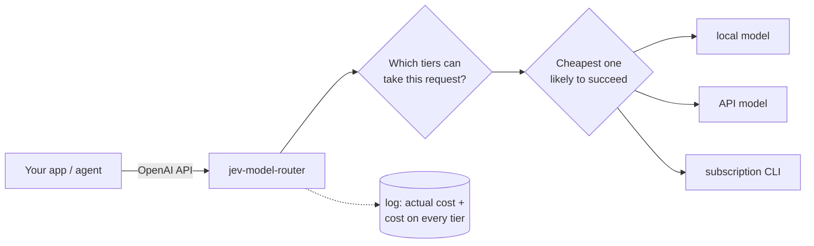

# jev-model-router

**One OpenAI-compatible endpoint. The cheapest model that can handle each request. A receipt
for every decision.**

Point any OpenAI client at this proxy instead of a vendor. For every request it picks a model
tier (a local Ollama model, an API model, a Claude Code or Codex subscription), forwards the
call, and logs what it cost *and what it would have cost on every other tier*. So "is routing
saving me money?" becomes a query you can run, not a claim you take on trust.



## What it does

- **Routes.** Picks a tier per request: fixed rules, a trained difficulty classifier, or
  per-requirement capability cards scored by [Jev](DESIGN.md#a-judge-that-is-not-a-model).
- **Filters first.** A tier whose context window is too small, or that lacks tool support the
  request needs, is never tried.
- **Verifies (optional).** A stronger tier (or Jev, for a fraction of the price) reviews the
  cheap answer; a failed answer is redone on the strong tier before the client sees it.
- **Keeps score.** SQLite log with the real bill and a counterfactual cost per tier.
  `stats` prints savings against *every* baseline, including the ones that make the router
  look bad.
- **Works for agents.** A route-only API and MCP server tell Claude Code or Codex which model
  and effort to hand a subtask to, without running it.

New models need no code change: they're discovered from your CLIs, Ollama, or any
`/models` listing (OpenRouter included) and scored from public benchmark data.

## Quick start

Python 3.11+.

```bash
pip install git+https://github.com/zDud4s/jev-model-router   # or: uv tool install / pipx install
jev-model-router init      # detects your CLIs, Ollama and API keys; writes a working config
jev-model-router serve     # http://127.0.0.1:8080
```

Then use it like any OpenAI endpoint:

```bash
curl http://127.0.0.1:8080/v1/chat/completions \
  -H 'content-type: application/json' \
  -d '{"model": "auto", "messages": [{"role": "user", "content": "hello"}]}'
```

Or from an SDK:

```bash
export OPENAI_BASE_URL=http://127.0.0.1:8080/v1
export OPENAI_API_KEY=unused      # the proxy holds the real keys
```

The response header `X-Router-Tier` says which tier answered. Open
<http://127.0.0.1:8080/routing> to watch decisions live, and run `jev-model-router stats`
to see what they cost.

## Configure by hand

`init` is the easy path. The Config tab of `/routing` edits the file the proxy was
started from: a form for the router, verification, server, log and tiers, and a YAML
view for everything else. A save is shown as a diff and checked by the same parser
`serve` uses before it is written; comments stay where they are, a file changed on disk
since the page read it is not overwritten, and the new config is served from the next
start. To write a config yourself, start from
[`config.example.yaml`](config.example.yaml). A tier is a few lines:

```yaml
tiers:
  cheap:
    backend: ollama               # ollama | openai_compatible | claude_cli | codex_cli | jev
    model: llama3.1:8b
    context_window: 131072
  top:
    backend: openai_compatible    # OpenAI, OpenRouter, vLLM, any compatible API
    model: some-strong-model
    base_url: https://openrouter.ai/api/v1
    api_key_env: TOP_KEY          # the config names the key; it never holds it
    prices: {input: 3.00, output: 15.00}   # USD per 1M tokens
```

```bash
jev-model-router keys set          # store missing keys in your user secrets file (no echo)
jev-model-router -c config.yaml check    # validate without starting anything
```

Keys come from the environment first, then from a per-user secrets file outside the repo.

## Use it from Claude Code or Codex

The repo is also a plugin marketplace. The plugin adds an MCP server (`route`,
`report_outcome`) and a skill that asks the router which model to give a subagent.

Run `jev-model-router init` first: the plugin's server reads the config it wrote, from
whatever project the agent has open. Only a config kept elsewhere needs
`JEV_MODEL_ROUTER_CONFIG=/path/to/config.yaml`.

```
# Claude Code
/plugin marketplace add zDud4s/jev-model-router
/plugin install jev-model-router@jev-model-router
```

```bash
# Codex
codex plugin marketplace add zDud4s/jev-model-router
codex plugin add jev-model-router@jev-model-router
```

Details, including the raw `/v1/route` API: [DESIGN.md](DESIGN.md#route-only-for-a-caller-that-runs-the-model-itself).

## Commands

| command | what it does |
|---|---|
| `init` | detect this machine and write a working config |
| `serve` | run the proxy |
| `stats` | read the log: spend, verdicts, savings vs every baseline |
| `check` | validate the config (`--prices` compares against OpenRouter's list) |
| `keys` | show which keys each tier needs; `keys set` stores them |
| `mcp` | the route-only API as MCP tools on stdio |
| `train`, `label` | fit the difficulty classifier from verdicts or an answer key |
| `calibrate`, `benchmarks` | turn benchmark data and logged outcomes into capability cards |
| `reconcile` | fetch the provider's real bill for rows that lack one |

`jev-model-router <command> --help` for the options.

## Honest numbers

This project publishes its failures. The first real classifier **did not beat "always use the
cheap model"**. Why (run-to-run variance in the model, not prompt difficulty) is in [DESIGN.md](DESIGN.md#the-first-real-corpus-said-no). Before trusting any
router, including this one, compare it with the one-line config change it competes against:
[a baseline worth beating](DESIGN.md#a-baseline-worth-beating).

## Development

```bash
python -m venv .venv
.venv/Scripts/python -m pip install -e ".[dev]"   # macOS / Linux: .venv/bin/python
.venv/Scripts/python -m pytest                     # no network, ~10 s
```

Design notes, measurements and the reasoning behind each mechanism: [DESIGN.md](DESIGN.md).
Contributor and agent conventions: [AGENTS.md](AGENTS.md).
